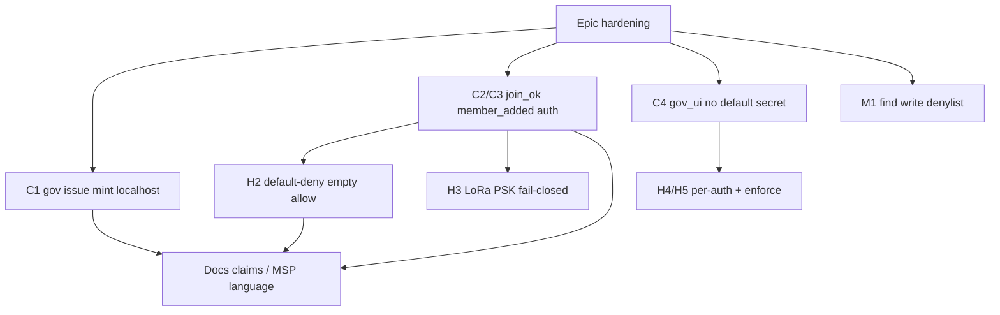

# Adv-review fix graph

Work topologically. Parallel ready leaves: **C1 ‖ C2 ‖ C4 ‖ M1**.

| ID | Status | Files |
|----|--------|-------|
| C1 | **done** | `win/swarmstate-node.c` — loopback-only mint |
| C2 | **done** | node `join_hub` + meshd `_join_sock` / allowlisted `member_added` |
| C4 | **done** | `gov_ui.py` — no default secret; bind `127.0.0.1` |
| H2 | **done** | empty allow = deny (`--demo` / `--open-mesh` to open) |
| H3 | **done** | `LoRaLink(require_psk=True)` / `SS_LORA_REQUIRE_PSK` |
| H45 | skipped | per-auth secrets — add when multi-secret deploy needed |
| M1 | **done** | `kernel.c` find `-fprintf/-fprint/-fls` |
| Docs | partial | deep-research folded; MSP/claim rewrite still open |

Check: `harness/test_adv_control.py` + pool/join tests OK.
